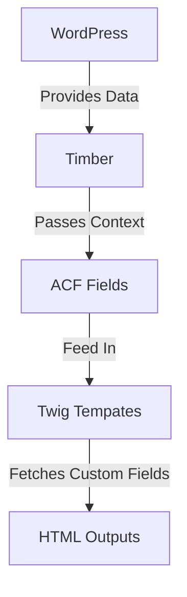
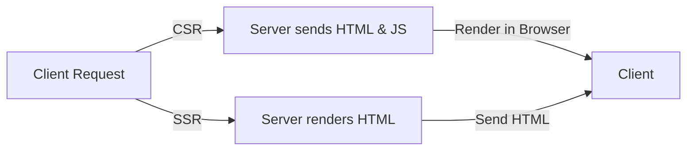

# Understanding Twig Templates and Fields in WordPress

Twig is a modern template engine for PHP that allows you to write cleaner, more readable, and maintainable code. It is used in combination with Timber to enhance the templating capabilities of WordPress.

## Twig Templates
[Timber Official Documentation](https://timber.github.io/docs/v2/)

Twig templates are the view layer of your application, separating your HTML from your PHP logic. This allows for a cleaner, more modular approach to theming.

### Basic Syntax

Twig templates use double curly braces `{{ }}` for outputting content and `` for logic structures such as loops and conditionals.

### Control Structures

- **Loops**: Iterate over arrays or objects.
- **Conditionals**: Add conditional logic to your templates.

## Fields in Twig Templates

Fields in Twig templates refer to the dynamic data passed from your WordPress site to the template. These fields can be custom fields created with ACF (Advanced Custom Fields) or standard WordPress fields.

### Example of ACF Fields

First, define your custom fields in the WordPress admin. Then, access them in your Twig template:

- **Fetch Fields**: Retrieve custom fields using ACF functions.
- **Render Fields**: Display custom fields in your Twig templates.

## Mermaid Diagram

Below is a Mermaid diagram to illustrate the relationship between Twig templates, WordPress, and ACF fields.

## SSR VS CSR

